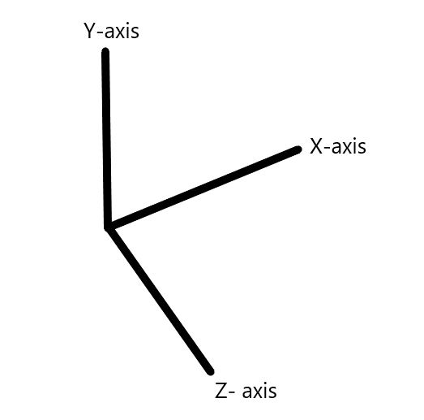

# StrucPy
[](https://github.com/TabishIzhar/StrucPy/actions/workflows/python-app.yml) [](https://opensource.org/licenses/)

**StrucPy** is a powerful python library for structural analysis. It give's complete control over the results of structure analysis. StrucPy is originally developed for the students and researchers working in field of civil engineering. It will be highly helpful for structural analysis, structural design, design optimization, visualizing the structural behavior, learning, application of machine learning in structural analysis, etc.

------------------------------------------------------------------------------------------------------------
## Modules 

* **RCFA** - Structural analysis module for Reinforced Concrete Framed Structures 
* **RCFooting** - (Under Development)

------------------------------------------------------------------------------------------------------------

## Project Objectives

Objective of **StrucPy** is to provide an easy to use open-source library for the upliftment of civil/structural engineering students, faculties and researchers without depending upon commercial licenses. 

*User Friendly*: StrucPy provides a user-friendly approach for the analysis of structure without the use of extensive coding. Its powerful methods perform almost every function required before and after analysis.  It reduces the user loads by allowing to pass input arguments through Excel formats. 

*Platform for Design Optimization*: StrucPy gives full access to pre- and post-analysis data of the structure. User can use those data's as per their requirement and research. Thus eliminates lack of control over data exchange and dependency on commercial software to perform analysis. 

*Validity*: StrucPy are continuously monitored to remove any bugs and errors. The output of StrucPy is verified with the commercial software's like Bentley's STAAD PRO connect edition. Users are requested to report any issue/error encountered while using StrucPy.

*Improvement*: StrucPy intents to provide accurate open source solution to every aspect of structural analysis. The codes are often checked for improvements and scope. 

------------------------------------------------------------------------------------------------------------

## Dependencies

Required Dependencies

* **numpy**: For matrix algebra and dense matrix solver
* **pandas**: For taking input and presenting output
* **plotly**: For visualization and plotting
* **ray**: For multi-processing
* **openpyxl**: To read Excel files

------------------------------------------------------------------------------------------------------------

## "RCFA" Module
----------------
**RCFA** provides solution to structural analysis of 2D and 3D Reinforced Concrete Members/ Frames(RCF). This module utilizes *stiffness matrix* approach to attain the solution. It covers every node's (joints), beam members and column members complete detail.

**Current Capabilities of RCFA**

* 2D and 3D static analysis of elastic reinforced concrete frame (RCF) structures.
* Considers self-weight, dead load, live loads, static seismic loads on the structure.
* Capable of transferring (Rectangular and Square) floor load to beams.
* Capable to evaluating the effective length of column members.
* Capable of handling sway frames.
* Gives accessibility to local and global stiffness matrix.
* Produces reactions and joint deflections' data. 
* Produces the 3D view of input RC model.
* Produces the deflected shape of RCF model.
* Produces animation of deflected shape of RCF model.
* Gives accessibility to data of shear forces, bending moments, and deflection of every member.  
* Produces the diagrams of shear forces, bending moments, and deflection of every member.
* Allows the passing of load combinations.
* Provides envelop result of all load combinations. 
 
#### **Under Development Capabilities of RCFA**

* P-delta analysis of structure.
* Inclusion of Wind Loads as per IS 875 part 3.
* Dynamic Seismic Analysis

-----------------------------------------------------------------------------------------------------------
## StrucPy Coordinate System 

Follow right-hand rule for coordinate system, the right thumb points along the z-axis in the positive direction and the curling motion of the fingers of the right hand represents a motion from the first or x-axis to the second or y-axis. 

Gravity loads acting along y-axis.



------------------------------------------------------------------------------------------------------------

## StrucPy Documentation

https://strucpy.readthedocs.io/

------------------------------------------------------------------------------------------------------------

## Installation 

```
    $ py -3 -m pip install StrucPy
```

------------------------------------------------------------------------------------------------------------

## Cloning Git repository

1) Clone the repository using **https://github.com/TabishIzhar/StrucPy.git**

2) Form a virtual environment using 
```
    $ py -3 -m venv venv
```

3) Activate virtual environment from cmd
```
    .\venv\Scripts\activate.bat
```

4) Install every dependency using requirement.txt
```
    (.venv) $ pip install -r requirements.txt
```
------------------------------------------------------------------------------------------------------------

## Preferred Integrated Development Environment (IDE)

For proper visualization of graphs and models.

* Jupyter Notebook
* VS Code 

-----------------------------------------------------------------------------------------------------------

## Usage

```python

from RCFA import RCF
from RCFA import RCFenv
import pandas as pd

# importing input data from file Example7, avaiable in InputFiles folder
member_details= pd.read_excel('./InputFiles/Example7.xlsx', 'members', header = 0, index_col=0)
nodes_details= pd.read_excel('./InputFiles/Example7.xlsx', 'nodes', header = 0, index_col=0)
boundcond = pd.read_excel('./InputFiles/Example7.xlsx', 'boundary', header = 0, index_col=0)
load_combo= pd.read_excel('./InputFiles/Example7.xlsx', 'load_combinations', header = 0, index_col=0)
seismic_defination= pd.read_excel('./InputFiles/Example7.xlsx', 'Seismic_Defination', header = 0, index_col=0)

#Creating Structural object r1 fopr single load combination and r2 for multiple load combination
r1= RCF(nodes_details,member_details,boundcond, load_combo= load_combo.iloc[0,:], autoflooring= True, seismic_def= seismic_defination)
r2= RCFenv(nodes_details,member_details,boundcond, load_combo= load_combo, autoflooring= True, seismic_def= seismic_defination)


#Pre processing the model
r1.preP()
r2.preP()

# Changing all floor loads with Floor Finish load as 50kN/m2
r1.changeFL(thickness= 0, LL=-25, FF=-50)
r2.changeFL(thickness= 0, LL=-25, FF=-50)

# Performing Analysis
r1.RCanalysis()
r2.RCanalysis()

#Call methods as per the requirement
```
------------------------------------------------------------------------------------------------------------
## Contributing

Pull requests are welcome. For major changes, please open an issue first to discuss what you would like to change.

Please make sure to update tests as appropriate.

------------------------------------------------------------------------------------------------------------

## License

[GNU LGPLv2.1](https://www.gnu.org/licenses/old-licenses/lgpl-2.1.en.html)
