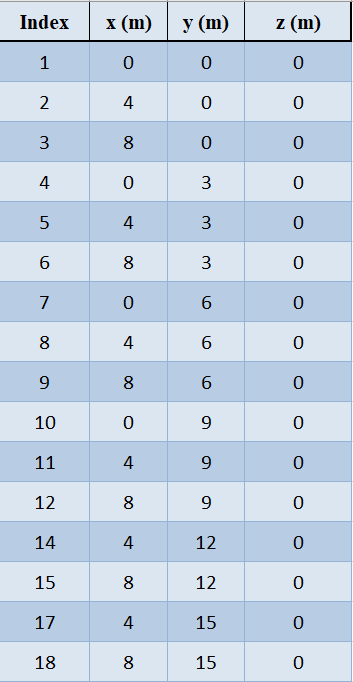
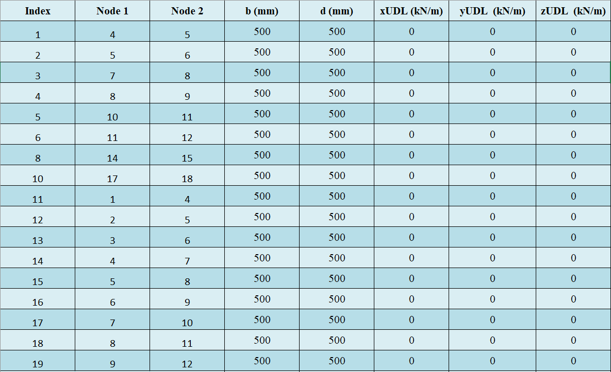
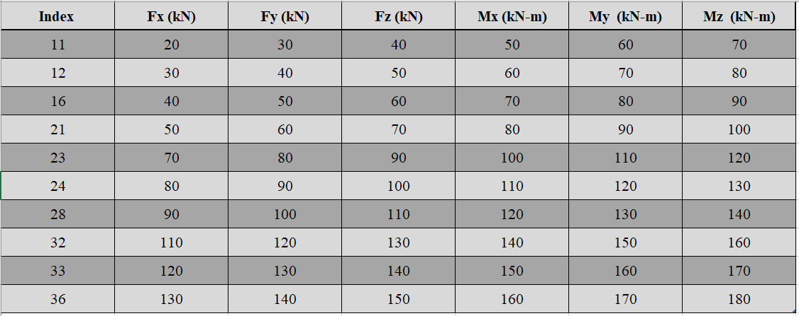
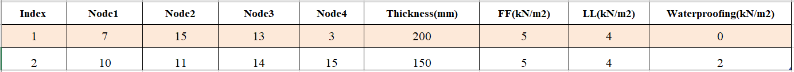
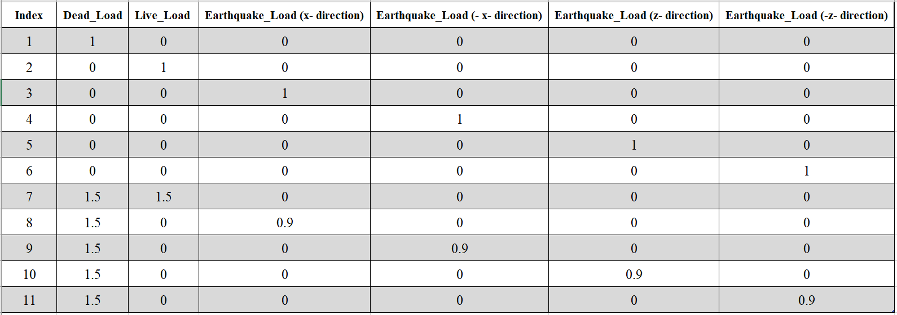

RCFA - Input Parameter
========================
In order to perform structural analysis of reinforced concrete element/frames. Following parameters are required: 

Nodes Details
----------------
`nodes_details` is a **Mandatory Parameter**, represents Nodes details of the reinforced concrete model and should be passed in *DataFrame*. It gives the joints detail of the reinforced concrete frame. The DataFrame must contain three columns. Nodes details columns are **positional arguments**.
The *index* of the Dataframe represents *Name of the Node*, it must be a *positive integer*.

* 1st Column must contain x-Coordinate of the nodes in **meters (m)**.
* 2nd Column must contain y-Coordinate of the nodes in **meters (m)**.
* 3rd Column must contain z-Coordinate of the nodes in **meters (m)**.

Note: The order of the nodes doesn't affect the results.

----------------

Member Details
--------------
`member_details` is a **Mandatory Parameter**, represents member details of the reinforced concrete model and should be passed in *DataFrame*. It presents beams and columns of the reinforced concrete frame. The DataFrame **must** contain *seven columns*. Columns of member details are **positional arguments**.

* 1st and 2nd Column must contain node number (node ID) between which member is connected.
* 3rd Column represents the width (b) of the member in **millimeter (mm)**.
* 4th Column represents the depth (d) of the member in **millimeter (mm)**.
* 5th Column represents uniformly distributed load (udl) on member in **Local x direction** in **kilonewton per square meter (kN/m2)**.
* 6th Column represents uniformly distributed load (udl) on member in **Local y direction** in **kilonewton per square meter (kN/m2)**.
* 7th Column represents uniformly distributed load (udl) on member in **Local z direction** in **kilonewton per square meter (kN/m2)**.

**Note:** 

* The order of the members doesn't affect the results.
* It's capable of taking rectangular and circular cross-sections input.
* For **rectangular cross-section**, both 3rd and 4th columns representing (b and d) must be defined.
* For **circular cross-section**, both 3rd representing (b) must be zero and 4th columns representing (d) must be defined some positive value. 

                
--------------------------

Boundary Conditions 
--------------------------
`boundarycondition` is a **Mandatory Parameter**, represents boundary condition of the reinforced concrete model and should be passed in *DataFrame*. It presents the joints condition of the reinforced concrete frame. The DataFrame **must contain the base joints** (joint connection between frame and ground). 

Rest other joints are optional. Boundary conditions have 6 columns representing each degree of freedom (Translation in x, Translation in y, Translation in z, Rotation in x (thetax), Rotation in y (thetay), Rotation in z (thetaz)).

*Value for each degree of freedom varies from 0 to 1, 0 representing complete restrained and 1 representing complete freedom for movement (like free end)*

* **Fixed Joint**: Assign zero to all six degree of freedom.
* **Pin Joint**: Assign zero to Translations in all three direction
* **Roller Joint**: Assign zero to Translations in all three direction except in the direction of roller.

Boundary conditions columns are **positional arguments**.

Note: The order of the nodes doesn't affect the results.

------------------------

Generate Frame
--------------------------
`framegen` of the reinforced concrete model is an **Optional Parameter**. It provides an information to automatically generate the reinforced concrete frame and should be passed in *DataFrame*. Dataframe of Nodal Forces must contain 2 columns representing number of bays and total length along bays in x, y and z direction. 

* 1st Row of DataFrame: 

   * Number of bay in x- direction (Length of RC Frame) - 1st Column of DataFrame
   * Total distance of bay in x- direction (Total Length of RC Frame) - 2nd Column of DataFrame

* 2nd Row of DataFrame: 

   * Number of bay in y- direction (Height of RC Frame) - 1st Column of DataFrame
   * Total distance of bay in y- direction (Total Height of RC Frame) - 2nd Column of DataFrame

* 3rd Row of DataFrame: 

   * Number of bay in z- direction (Width of RC Frame) - 1st Column of DataFrame
   * Total distance of bay in z- direction (Total width of RC Frame) - 2nd Column of DataFrame

**Default is None i.e. No auto generation**

`framegen` rows and columns are **positional arguments**.

.. figure::  ./images/FG.png
   :align: center

------------------------

Nodal Forces Details
--------------------------
`forcesnodal` is an **Optional Parameter**, represents the forces at the joints of the reinforced concrete frame and should be passed in *DataFrame*. Dataframe of Nodal Forces must contain 6 columns representing force's and moment's in every direction. Nodal forces can only be point forces or moments. 

**Forces applied on joints are in Global Coordinate System**.

* Force in x (Fx - kN) - 1st Column of DataFrame
* Force in y (Fy - kN) - 2nd Column of DataFrame
* Force in z (Fz - kN) - 3rd Column of DataFrame
* Moment in x (Mx - kNm) - 4th Column of DataFrame
* Moment in y (My - kNm) - 5th Column of DataFrame
* Moment in z (Mz - kNm) - 6th Column of DataFrame

**Default is None i.e. No nodal forces**

Nodal forces columns are **positional arguments**.

Note: The order of the nodes doesn't affect the results.

------------------------

Slab Details
------------
`slab_details` is an **Optional Parameter**, which represents the floor load of the reinforced concrete frame and should be passed in *DataFrame*. Dataframe of slab details contains 8 columns representing:

Node 1 to node 4 are the four corners of a trapezoidal slab/floor.

* "Node 1" - 1st Column of DataFrame (It should be the node index/id)
* "Node 2" - 2nd Column of DataFrame (It should be the node index/id) 
* "Node 3" - 3rd Column of DataFrame (It should be the node index/id)
* "Node 4" - 4th Column of DataFrame (It should be the node index/id)
* Thickness of slab or floor in millimeter (mm) - 5th Column of DataFrame
* "Floor Finish Load" (*Should be passed 0 if no load*) - 6th Column of DataFrame
* "Live Load" (*Should be passed 0 if no load*) - 7th Column of DataFrame
* "Water Proofing Load" (*Should be passed 0 if no load*) - 8th Column of DataFrame 

**Default Value is None i.e. No slab/floor loads**.

Slab details columns are **positional arguments**.

Note: The order of the slab/floor doesn't affect the results.

------------------------

Load Combination Details
------------------------
`load_combo` is an **Optional Parameter**,s represents the combination of different loads with load factors acting on the reinforced concrete frame and should be passed in *DataFrame*. Dataframe of load combination may contain up to 6 columns representing:

* "Dead Load" - 1st Column of DataFrame
* "Live Load" - 2nd Column of DataFrame
* "Seismic Load in x direction" - 3rd Column of DataFrame
* "Seismic Load in -x direction" - 4th Column of DataFrame
* "Seismic Load in z direction" - 5th Column of DataFrame
* "Seismic Load in -z direction" - 6th Column of DataFrame

**Default is None (Only Dead Load will be considered with load factor 1)** 
 

Load combination columns are **positional arguments**.

Note: Only one load combination is considered RCF class. To check for different load combination ENV class should be used.

------------------------

Seismic Definition
------------------------
`seismic_def` is a parameter for Seismic definition of the reinforced concrete model and is an **Optional Parameter**.  It is required when user want to perform the Equivalent Static Seismic Analysis and should be passed in *DataFrame* or *numerical value*.  

**Dataframe** should be used when seismic definition is as per IS1893:2016.
**Value of Time Period** in seconds must be passed when seismic analysis is to be done with some other standard codes.

Dataframe of seismic definition may contain up to 6 columns representing:

* "Seismic Zone Factor (Z)" - 1st Column of DataFrame
* "Response Reduction Factor (R)" - 2nd Column of DataFrame
* "Design Acceleration Coefficient for Different Soil Type (Sag) *optional parameter if using IS1893*" - 3rd Column of DataFrame
* "Damping (%) *optional parameter if using IS1893*" - 4th Column of DataFrame
* "Soil Type (1 for Hard/Rocky Soil Type, 2 for Medium Soil Type and 3 for Soft Soil Type) *Mandatory parameter if using IS1893*" - 5th Column of DataFrame
* "Time Period (sec) *optional parameter if using IS1893*" - 6th Column of DataFrame

**Default is None (No Seismic Analysis).** 
 
Seismic Definition columns are **positional arguments**.

Note: Soil Type is needed only for seismic analysis as per IS1893:2016. If user wishes to use some other code, values of "z", "I", "R" and "Sag" must be provided 

------------------------

Material Properties
------------------------
`properties` represents material properties of the members of reinforced concrete model and is an **Optional Parameter**. It is required when user want to use some other material or concrete with different properties, should be passed as *DataFrame*.  Dataframe of material properties may contain up to 9 columns representing:

* "Type" - 1st Column of DataFrame
* "Material" - 2nd Column of DataFrame
* "Grade M- (N/mm2)" - 3rd Column of DataFrame
* "Density (kN/m3)" - 4th Column of DataFrame
* "Young Modulus (E -kN/m2)" - 5th Column of DataFrame
* "Poisson's Ratio (mu)" - 6th Column of DataFrame
* "Thermal Coefficient (alpha)" - 7th Column of DataFrame
* "Critical Damping" - 8th Column of DataFrame
* "Modulus of Rigidity (G -kN/m2) " - 9th Column of DataFrame

**Default is None (Concrete). Concrete with following properties:**"** 

* Concrete of Grade M25- 25 N/mm2 is being used as default.
* Young Modulus (E - kN/m2) = 5000 * sqrt(25)
* Poisson's Ratio (mu) = 0.17
* Thermal Coefficient (alpha) = 
* Modulus of Rigidity (G -kN/m2) = E/ (2*(1+mu))
* Critical Damping = 0.05 (5%)
* Type: "All"- Properties assigned to every member (Beam, Column and Slabs)

      * "Beam"- Properties assigned to only beams 
      * "Column"- Properties assigned to only columns
      * "Slab"- Properties assigned to only slabs

Note: Succeeding "Type" arguments overrides previous type. If "Beam" follows after "All" type, Beams properties will be modified.

Material Properties columns are **positional arguments**.

.. figure::  ./images/pp.png
   :align: center

------------------------

Concrete Grade
------------------------
`grade_conc` represents concrete grade of the members of reinforced concrete model and is an **Optional Parameter**. It is required when user want to *only change the Grade of Concrete of the default concrete grade i.e. M25*.  The value of Young modulus, modulus of rigidity is calculated as per the formula mentioned in **Material Properties**. 

**Default is None (Concrete M25- Compressive Strength of 25 N/mm2).**

------------------------

Self Weight
------------------------
`self_weight` represents self weight of the members of reinforced concrete model and is an **Optional Parameter**. It should be passed as Boolean operator. It determines, if self weight of the members has to be included in analysis or not. 

*Default is True (Self Weight will be considered)*. 
 
------------------------

Infillwall
------------------------
`infillwall` represents infillwall of the reinforced concrete model and is an **Optional Parameter**. It determines if infillwall will be considered while calculating Time Period during seismic analysis or not and should be passed as *Boolean*. 

**Default is False (Infillwall will not be considered)**. 

**Note:** Infillwall argument has to be only provided when Seismic analysis is being done as per IS1893:2016 Part 1.

------------------------

Autoflooring
------------------------
`autoflooring` is an **Optional Parameter** and helps greatly in reducing the work load of inputting every slab detail on a reinforced concrete frame. Autoflooring argument, automatically apply slab/floor load, making easy for the user to manipulate and should be passed as *Boolean* operator.

**Default is False (Autoflooring will not be considered)**. 

If Autoflooring is True. Default values are- 

* Thickness of Floor is 150 millimeters (mmm)
* Floor Finish Load (FF): 1 kN/m2
* Live Load (LL): 3 kN/m2
* "Waterproofing Load ": 0 kN/m2. 

**Note**: It can further be changed using class method `Strucpy.RCFA.RCF.changeFL()` as per the requirement.

------------------------

Point Loads
------------------------
`point_loads` represents point loads acting on the member or members of reinforced concrete model. It is an **Optional Parameter**. It is required when user want to place point loads on a member, should be passed as *DataFrame*.  Dataframe of point loads contains up to 3 columns representing:

* "Load in (kN)" - 1st Column of DataFrame.
* "Direction" i.e (x, y or z) in local coordinate system - 2nd Column of DataFrame.
* "Distance (m)" from node which is nearer to the origin - 3rd Column of DataFrame.
* Index must be ID/Name of the member on which point load is acting.

**Default is None. (No point Loads)**

Note: It's capable of handling multiple point loads.

Point loads columns are **positional arguments**.

.. figure::  ./images/PL.png
   :align: center

------------------------

Stability Index
------------------------
`col_stablity_index` represents stability index of a reinforced concrete member/frame and is an **Optional Parameter**. Stability index value helps in classifying columns as sway or non-sway. Its value can be passed as per the user requirement. 

**Default value is 0.04. (IS456:2000)**. 

------------------------