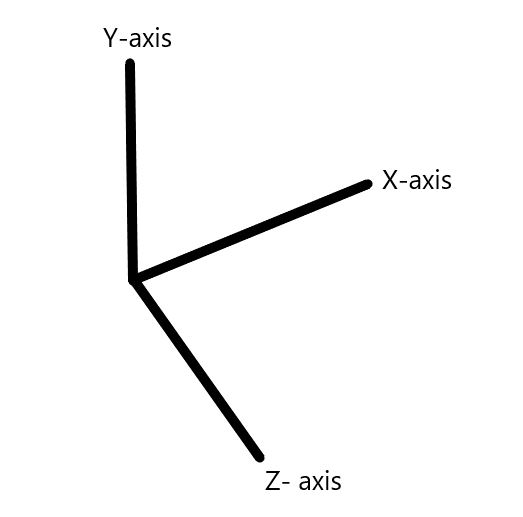

Overview of StrucPy
====================

**StrucPy** is a powerful python library for structural analysis. This library user *stiffness matrix* and *Finite Element Method* approach to attain the solution.  It's a powerful library that give's complete control over the results of structure analysis. StrucPy is originally developed for the students and researchers working in field of civil engineering. It will be highly helpful for optimization, design, visualizing the structural behavior, learning, application of machine learning in structural analysis, etc.

The uniqueness of *StrucPy* is that it gives full control to the user over the model. Apart from the result, user can always access and make change to the input arguments. Further user will have access to the data's generated during the analysis. Result are presented in apprehensible tabular form which can be exported.

Usually the model input can vary from 1 to 1000's members depending upon the complexity of the structure. StrucPy provides a simple method for input in form of *Dataframe*, capable of taking any number of input which can be easily be cross-checked and processed. StrucPy make handling structural complexity easier.

**Why Dataframe?**
Dataframe has been chosen for the simplicity and usability. 
Generally some formats such as *.csv, .xls, .xlsx* etc. are very common and easy to handle structural model details. Dataframe's can be imported from these formats, reducing the coding work load. 

-------------------

Project Objectives
-------------------
Objective of **StrucPy** is to provide an easy to use open-source library for the upliftment of civil/structural engineering students, faculties and researchers along with development.

*Validity*: StrucPy are continuously monitored to remove any bugs and errors. The output of StrucPy is verified with the commercial software's like Bentley's STAAD PRO and CSI ETABS. Users are requested to report any issue/error encountered while using StrucPy.

*User Friendly*: StrucPy provides a user-friendly approach for the analysis of structure without the use of extensive coding allowing user to pass input arguments through Excel formats. In order to operate and visualize analysis results user needs basic knowledge of python and some libraries like Pandas and Numpy.

*Improvement*: StrucPy intents to provide open source solution to every aspect of structural analysis. In order to achieve StrucPy is working towards various module. The codes are often checked for improvements.

*Freedom*: StrucPy believes in the freedom of imagination and application. Thus, StrucPy gives full access to pre- and post-analysis data of the structure. User can use those data's as per their requirement and research.

----------------

Dependencies
----------------
Required Dependencies

* **numpy**: used for matrix algebra and dense matrix solver
* **pandas**: used for taking input and presenting output
* **plotly**: used for visualization and plotting
* **ray**: used for fast processing
* **openpyxl**: *optional* to read Excel files

------------------------------------------------------

StrucPy Coordinate System 
--------------------------
Follow right-hand rule for coordinate system, the right thumb points along the z-axis in the positive direction and the curling motion of the fingers of the right hand represents a motion from the first or x-axis to the second or y-axis. 

Gravity loads acting along y-axis.

----------------------------------------------------------

Modules 
----------------
* **RCFA** - Structural analysis module for Reinforced Concrete Framed Structures 
* **RCFooting** (Under Development)
* **Over Head Tank** (Under Development)
* **Truss** (Under Development)

----------------

RCFA
----------------
**RCFA** provides solution to structural analysis of 2D and 3D Reinforced Concrete Members/ Frames(RCF). This module utilizes *stiffness matrix* approach to attain the solution. It covers every node's (joints), beam members and column members complete detail.

**Current Capabilities of RCFA**

* 2D and 3D static analysis of elastic reinforced concrete frame (RCF) structures.
* Considers self-weight, dead load, live loads, static seismic loads on the structure.
* Capable of transferring (Rectangular and Square) floor load to beams.
* Capable to evaluating the effective length of column members.
* Capable of handling sway frames.
* Gives accessibility to local and global stiffness matrix.
* Produces reactions and joint deflections' data. 
* Produces the 3D view of input RC model.
* Produces the deflected shape of RCF model.
* Produces animation of deflected shape of RCF model.
* Gives accessibility to data of shear forces, bending moments, and deflection of every member.  
* Produces the diagrams of shear forces, bending moments, and deflection of every member.
* Allows the passing of load combinations.
* Provides envelop result of all load combinations. 

 
**Under Development Capabilities of RCFA**

* P-delta analysis of structure.
* Inclusion of Wind Loads as per IS 875 part 3.
* Dynamic Seismic Analysis

----------------------------------------------------------

License
--------

[GNU LGPLv2.1] 
((https://www.gnu.org/licenses/old-licenses/lgpl-2.1.en.html))

----------------------------------------------------------
.. note:: This project is under active development.

